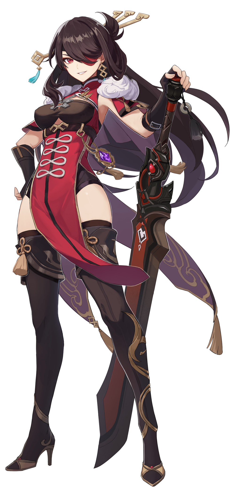

# Electro

## Lisa

### Character Role**s: Sub DPS \(Burst\), Utility \(Debuffer\)**

**Main Damage Source: Elemental Skill**

**Character Specialization:**

* Burst Elemental Skill that does **AoE** damage
* Consistent Electro application with Elemental Burst
* Elemental Skill has **highest burst damage ratio** compared to other characters

**Quirks and Niches:**

* Her Elemental Burst **shreds DEF%.** Only character to do so **without Constellations**
* Higher Burst Damage the more stacks enemies have
* Can get **2-3 stacks** with a **single** skill cast with elemental reactions.

**Synergies:**

* Burst Teams
* Electrocharged Team
* Superconduct Team

**In-Depth Lisa Guide Here:**



## **Fischl**

### Character Roles: Sub DPS \(Off-Field\), Main DPS \(Sustained\), Utility \(Energy Battery\)

**Main Damage Source: Elemental Skill, Normal Attacks \(Main DPS\)**

**Character Specialization:**

* Energy Battery
* Consistent Electro Application
* Skills work off-field

**Quirks and Niches:**

* **C1** allows her to be a Physical Main DPS as Oz will attack with her when not summoned with normal attacks
* **C6** makes other characters work like her **C1** and increases the **duration** he is on-field. Oz will do **Electro DMG**

**Synergies:**

* Superconduct Team
* Electrocharged Team
* Overload Team

**In-Depth Fischl Guide Here:**



## **Beidou**

### Character Role: Main DPS \(Sustained\), Sub DPS \(Off-Field\)

**Main Damage Source: Elemental Burst**

**Character Specialization:**

* Knockback resistance and damage reduction provide strong survivability
* Top AOE DPS
* Self-Cleanser. Removes Elemental Debuffs

**Quirks and Niches:**

* C2 unlocks 90% of her potential
* Best used against more than one enemy, preferably unmovable ones if using overload reaction

**Synergies:**

* Fast attacking characters
* Electrocharged Team
* Overload Team

**In-Depth Biedou Guide Here:**



## Razor

### Character Role**: Main DPS \(Sustained\)**

**Main Damage Source: Normal Attacks**

**Character Specialization:**

* Physical Normal Attacks
* Self-Cleanser. Removes Elemental Debuffs

**Quirks and Niches:**

* Elemental Burst gets **Cancelled** if you swap out.
* **Increased Energy Regen** from his Elemental Skill
* C1 makes energy particles **Increase Razor's DMG by 10%**

**Synergies:**

* Superconduct Team

**In-Depth Razor Guide Here:**



## **Keqing**

### Character Roles: Main DPS \(Sustained/Burst\)

**Main Damage Source: Charged Attack**

**Character Specialization:**

* Electro Infusion from her Elemental Skill.
* High Charged Attack Damage
* High Mobility
* Consistent Electro Application with her Infused Normal Attacks. For Overload/Electrocharged Reactions

**Quirks and Niches:**

* **Buffs** her own **Critical Rate and Energy Recharge** by **15%** with Elemental Burst.
* Can mainly play either Physical or Electro Builds.

**Synergies:**

* Superconduct Team \(Physical\)
* Electrocharged/Overload Teams \(Electro\)

**In-Depth Keqing Guide Here:**



