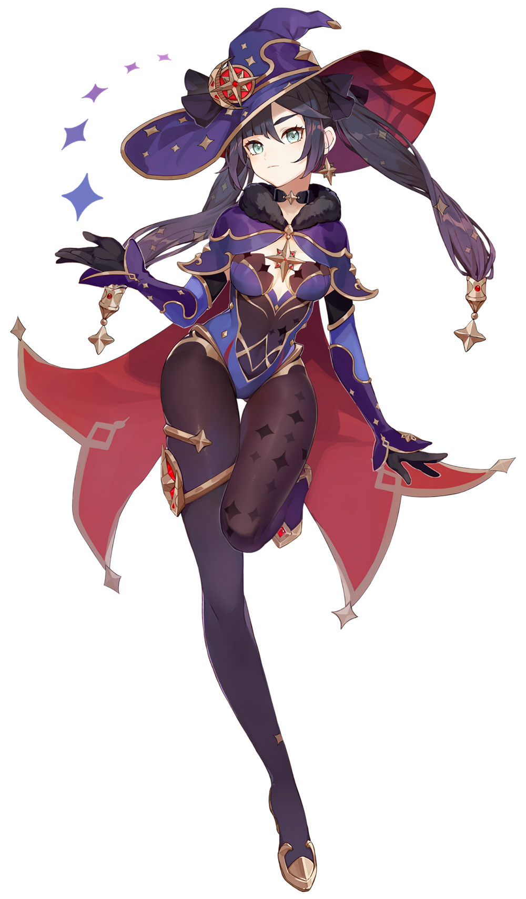

# Hydro

## Barbara

### Character Role: Healer**, Utility \(Buffer C2\)**

**Main Damage Source: Normal/Charged Attack**

**Character Specialization:**

* Sustained Healing with Elemental Skill. Works Off-Field
* Burst Healing with Elemental Burst
* Cleanser. Removes Elemental Debuffs

**Quirks and Niches:**

* When her **Elemental Skill** is active her **normal/charged** attacks heal the party
* **C2** makes her Elemental Skill **Buff Hydro Damage** when it's active.
* **C6** will **Automatically Revive** 1 fallen party member to Full Health every 15 minutes

**Synergies:**

* Hydro DPS characters
* Electrocharged/Vaporise Team

**In-Depth Barbara Guide Here:**



## **Xingqiu**

### **Character Role: Sub DPS \(Off-Field\), Utility \(Energy Battery\)**

**Main Damage Source: Elemental Burst**

**Character Specialization:**

* All skills work Off-Field
* Consistent Hydro Application when Elemental Burst is Active
* Energy Battery
* Damage Reduction with his Rain Sword Shield
* Self-Cleanser. Removes Elemental Debuffs

**Quirks and Niches:**

* **C2** Increases the duration of his Burst by 3 seconds and reduces Hydro Res by 15% when hit by a rain sword. This increases his DPS and extends his consistency with hydro application.
* **C6** Gives back energy to Xingqiu. He can get back up to 30 Energy throughout the duration of his Burst.

**Synergies:**

* Melt/Vaporise/Electrocharged Sustained DPS Team
* Normal Attack Characters

**In-Depth Xingqiu Guide Here:**



## Tartaglia

### **Character Roles: Main DPS \(Burst/Sustained\), Sub DPS \(Burst\)**

**Main Damage Source: Elemental Skill \(Sustained\), Elemental Burst \(Burst\)**

**Character Specialization:**

* **Massive** Burst Damage. Can **Oneshot** Enemies with Elemental Reactions
* Consistent Hydro Application with his Elemental Skill. For Freeze/Electrocharged Reactions
* Has Riptide Effect which does extra Hydro Damage

**Quirks and Niches:**

* **C1** Reduces Cooldown of Elemental Skill by 20% allowing for more Sustained DPS.
* **C6** Resets the Cooldown of his Elemental skill when his elemental burst is used.
* He can **Increase Talent Levels** of Normal Attacks by 1.

**Synergies:**

* Vaporise Burst DPS Team
* Electrocharged Team
* Normal Attack DPS Character

**In-Depth Tartaglia Guide Here:**











## **Mona**

### Character Roles: Sub DPS \(Burst\), Utility \(Crowd Control\(CC\), Buffer\)

**Main Damage Source: Elemental Burst**

**Character Specialization:**

* **Massive** Elemental Burst Damage. Can **Oneshot** Enemies with Elemental Reactions
* **Crowd Control** with her Elemental skill **\(Taunt\)**

**Quirks and Niches:**

* Sets up combos for Main DPS
* Enemies hit with her **Elemental Burst** take increased damage from **Omen Buff**
* **C1** Increases Damage of Elemental Reactions by 15% on enemies with **Omen.** This Greatly Increases The DPS of any character that rely on reactions as well as Mona's
* **C4** Increases Crit Rate of active character by 15% on enemies with **Omen**
* Mona's **Bubble** can be **frozen** to extend the **duration** of Omen

**Synergies:**

* Burst DPS Characters
* Vaporise Burst Team

**In-Depth Mona Guide Here:**



\*\*\*\*

