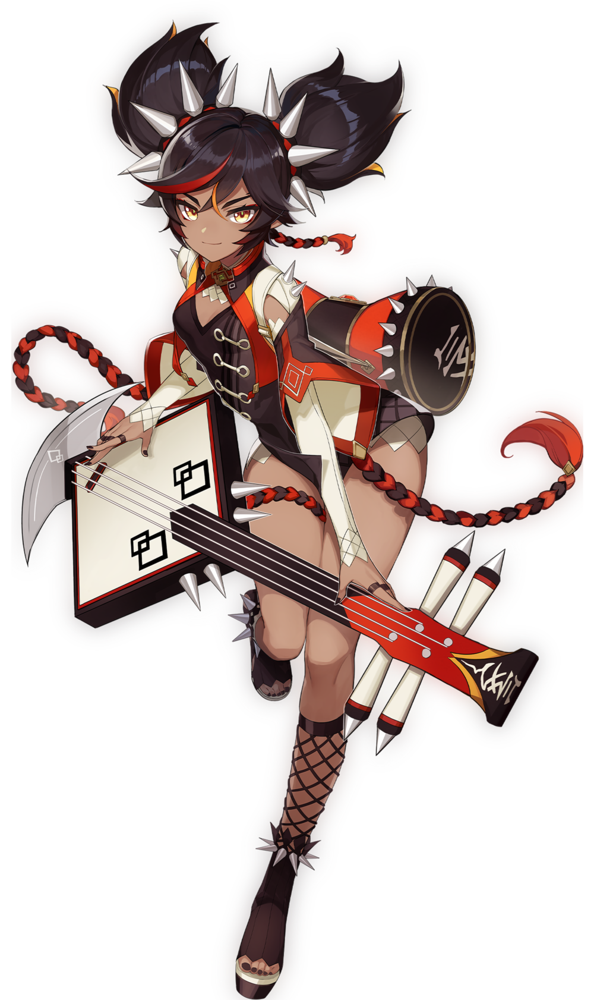

# Pyro





## Amber

### Character Roles: **Main DPS\(Sustained\)** Sub DPS \(Burst\), Utility \(Crowd Control\(CC\)\)

**Main Damage Source: Burst \(Sub DPS\), Normal/Charged Attack \(Main DPS\)**

**Character Specialization:**

* Crowd Control with her Elemental Skill **\(Taunt\)**
* Shield Breaker \(Cryo Shields\)
* Burst Damage

**Quirks and Niches:**

* Best used to set up combos for Main DPS
* **C2** allows amber to make Baron Bunny explode with charged shots for extra **Burst Damage**
* **C6** gives Movement% and ATK% Speed to party after using Burst

**Synergies:**

* Vaporise Burst Team

**In-depth Amber Guide here:** 



\*\*\*\*

## Xinyan

### Character Roles: Main DPS\(Sustained C0/Burst C2\), Sub DPS \(Off-Field\), Utility \(Buffer/Cleanser\), Healer \(Shields\)

**Main Damage Source: Charged Attacks**

**Character Specialization:**

* Shielder. Her Shield can reach 3 tiers depending on **No. Enemies Hit**
* Physical DMG Buffer
* Charged Attack **\(Main DPS\)**
* Cleanser. Removes Elemental Debuffs
* Deal Elemental DPS Off-Field. \(Tier 3 Shield\)

**Quirks and Niches:**

* **C2** allows her to shift her playstyle to a **Burst DPS**
* **C4** makes Xinyan a **Debuffer** by **reducing Physical DMG** when casting **Elemental Skill**

**Synergies:**

* Superconduct Team
* Burst Team

**In-depth Xinyan Guide here:**



## Bennett

### Character Roles: Healer, Utility \(Buffer/Cleanser/Energy Battery\), Main DPS \(Sustained\)

**Main Damage Source: Elemental Skill**

**Character Specialization:**

* ATK Buff from his Elemental Burst
* Energy Battery
* Healing inside Burst
* Elemental Skill Spam
* Cleanser. Removes Elemental Debuffs

**Quirks and Niches:**

* **C1** makes his Elemental burst heal and buff at the same time. It also makes his buff stronger.
* **C6** Infuses melee attacks into Pyro Damage. **\(Proceed with Caution as it can ruin some synergies\)**

**Synergies:**

* Works in **Every** Single Team! Except a Hu Tao sustained team.

**In-Depth Bennett Guide Here:**



## Xiangling

### Character Roles: Main DPS\(Burst/Sustained\), Sub DPS \(Burst\)

**Main Damage Source: Elemental Burst \(Burst\), Normal/Charged Attacks \(Sustained\)**

**Character Specialization:**

* All skills work Off-Field
* Sets up Elemental Reactions with Elemental Skill and Burst
* Burst Elemental Damage
* Physical Normal/Charged Attacks **\(Sustained Main DPS\)**
* Buffs Active Character with pickup

**Quirks and Niches:**

* Sets up Elemental Reactions with consistent pyro from her Burst.
* Her Burst DPS increases exponentially when she does the reactions. 
* **C4** makes her Elemental Burst last 40% increasing her Burst DPS.

**Synergies:**

* Melt/Vaporise Burst Team

**In-Depth Xiangling Guide Here:**











\*\*\*\*

## Klee

### Character Role: Main DPS \(Sustained\)**, Utility \(Debuffer C2\)**

**Main Damage Source: Charged Attack**

**Character Specialization:**

* Off-Field Damage with Elemental Skill
* Charged Attack Spam
* Only deals Elemental Damage
* High Rate of Pyro Application

**Quirks and Niches:**

* Elemental Burst gets **Cancelled** if you swap out. At C4 swapping out causes an **AoE Explosion**
* **C2** makes her Elemental Skill **reduce enemy DEF by 12%**
* Can **animation cancel** during attack combo for extra DPS

**Synergies:**

* Melt/Vaporise Team

**In-Depth Klee Guide Here:**











## Diluc

### **Character Role: Main DPS \(Sustained\)**

**Main Damage Source: Pyro Damage**

**Character Specialization:**

* Consistent Pyro DMG with all skills/attacks
* Pyro Infusion during Elemental Burst
* Elemental Burst Covers Wide **AoE**
* Combo Elemental Skill with Normal Attack. 
* Deals more damage with Reactions

**Quirks and Niches:**

* Easy to Learn
* **C2, C4 and C6** Increases DMG of his E and Normal Attack Combo
* Can use a hard-to-master ****technique to deal more DPS than Normal Attacks

**Synergies:**

* Melt/Vaporise Team

**In-Depth Diluc Guide Here:**











## Hu Tao

### Character Roles: Main DPS \(Burst/Sustained\)

**Main Damage Source: Charged Attack/Elemental Burst**

**Character Specialization:**

* Pyro Infusion from her Elemental Skill. **Costs 30% Current HP**
* Stronger when **under 50% HP**
* Self-heals with Burst
* Charged Attack Spam
* Massive Burst Damage. Can Oneshot Enemies with Elemental Reactions

**Quirks and Niches:**

* **C1** makes her charge attacks cost no stamina during her Elemental skill.
* **C6** allows her to not build any crit rate increasing her Burst DPS Potential.
* Can **animation cancel** during attack combo for extra DPS

**Synergies:**

* Melt/Vaporise Team
* Shield Character

In-Depth Hu Tao Guide Here:



